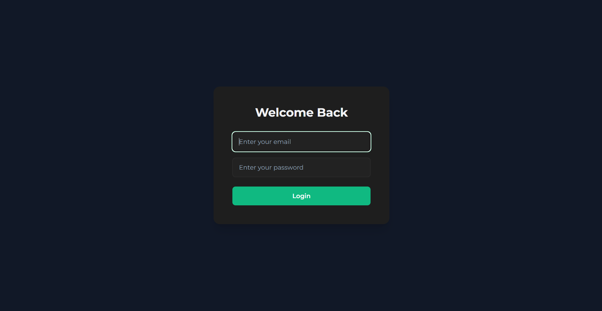
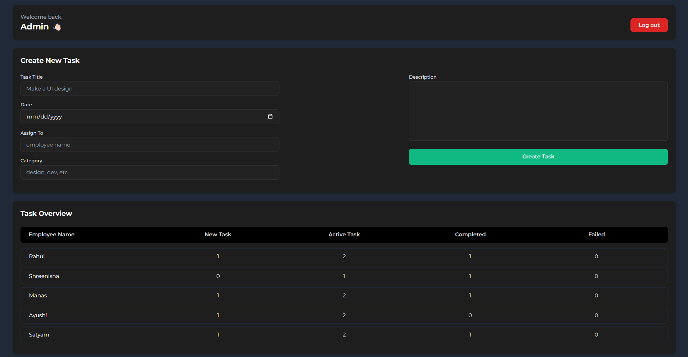
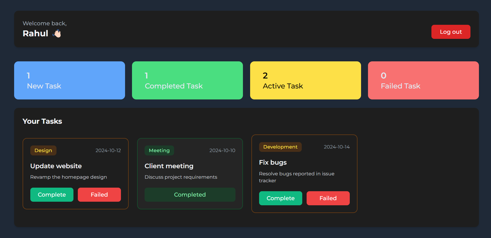

# EMS

An real time employee task management web application that supports role-based login (admin and employee) and provides features like task creation, updating, marking as completed/failed, and viewing task statistics.

## User Login Credentials

Below are the default login credentials to access the application:

### Admin Login

- **Email:** admin@example.com
- **Password:** 12345678

### Employee Logins

1. **Employee 1:**

   - **Email:** employee1@example.com
   - **Password:** 12345678

2. **Employee 2:**

   - **Email:** employee2@example.com
   - **Password:** 12345678

3. **Employee 3:**
   - **Email:** employee3@example.com
   - **Password:** 12345678

and so on....

## Project Images

<p align="center"> 
 <br/><br/> 
 <br/><br/> 
 
</p>

## Installation
1. Clone the repository:
   ```bash
   git clone https://github.com/sars0903/ems-main.git
   ```
2. Navigate to the project directory:
   ```bash
   cd ems-main
   ```
3. Install dependencies:
   ```bash
   npm install
   ```
4. Start the development server:
   ```bash
   npm run dev
   ```
5. Open your browser and visit **`localhost:5173`**

